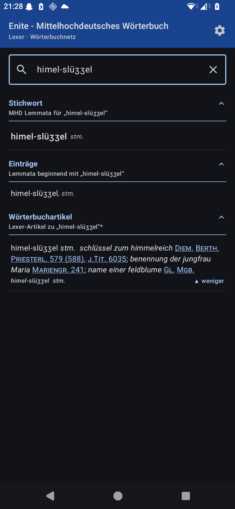
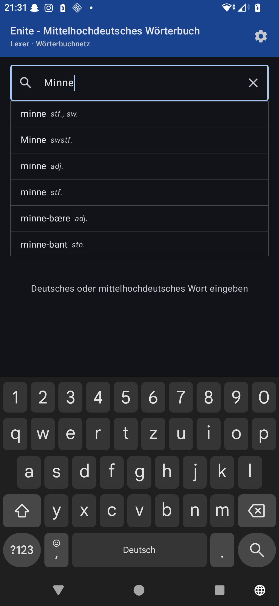
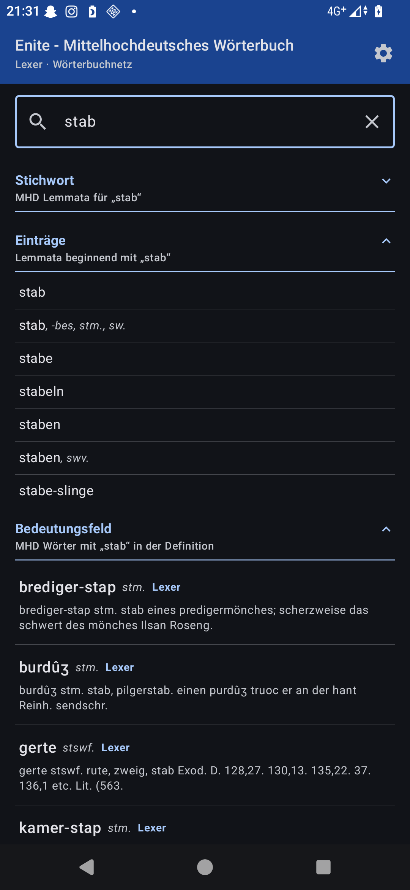

<div align="center">
  
  <h1>Enite – Mittelhochdeutsches Wörterbuch</h1>

  [](https://github.com/Gornhoth/enite-mittelhochdeutsches-woerterbuch/releases)
  [](https://f-droid.org/packages/at.jschatteiner.enitemhdtranslator/)
  [](LICENSE)
</div>

Android-App zur Suche in mittelhochdeutschen Wörterbüchern über die [Wörterbuchnetz](https://www.woerterbuchnetz.de/)-API des Kompetenzzentrums für elektronische Erschließungs- und Publikationsverfahren in den Geisteswissenschaften an der Universität Trier.

## Screenshots

<p>
  
  
  
</p>

## Funktionen

- **Stichwortsuche** — Direkte Suche nach MHD-Lemmata im Lexer
- **Definitionssuche** — Deutsche Begriffe in den Definitionen aller verlinkten Wörterbücher finden (Lexer, BMZ, FindeB, MWB, AWB, DWB u. a.)
- **Wörterbuchartikel** — Vollständige Artikeltexte mit Formatierung und Quellenverweisen
- **Autovervollständigung** — Vorschläge während der Eingabe
- **Dark Mode** — System-, Hell- und Dunkelmodus

## Voraussetzungen

- Android 6.0 (API 23) oder höher
- Internetverbindung

## Bauen

Für eine signierte Release-APK:

```bash
export KEYSTORE_PASSWORD="..."
export KEY_PASSWORD="..."
./gradlew assembleRelease
```

## Hinweise

Die Wörterbuchdaten werden über die öffentliche API des [Wörterbuchnetzes](https://www.woerterbuchnetz.de/) abgerufen. Diese App ist ein unabhängiges Open-Source-Projekt und steht in keiner Verbindung zur Universität Trier oder zum Kompetenzzentrum.

## Datenschutz

[Datenschutzerklärung / Privacy Policy](PRIVACY.md)

## Lizenz

[MIT](LICENSE)
